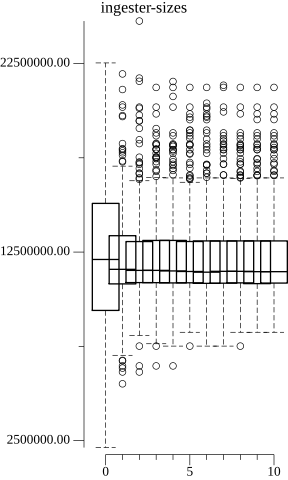
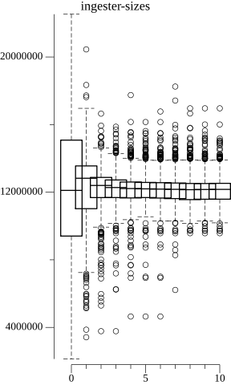
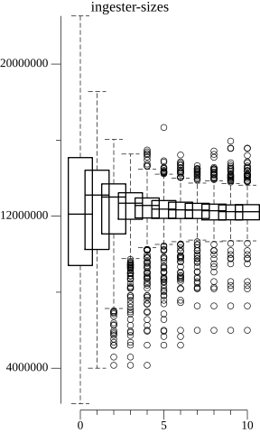
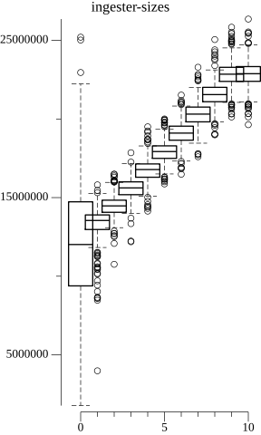

# Problem Statement

Tenant series are not evenly balanced across ingesters. For the purpose of this
repo I assume that series are evenly distributed within a tenant. This is not
true, but is a helpful simplification to evaluate shuffle sharding algorithms.

# Overview

In my experiments I investigated the idea of allowing tenants to be “resharded” by adding an int64 seed value that gets mixed in to the shuffle sharding hash along with tenant and zone ids.
This seed value would need to be shared across ingesters, queriers, rulers, and distributors. As a strawman, assume it is a property of the tenant overrides in the runtime configuration, but it could eventually be stored somewhere else.

I found the following algorithm to work best, but my code doesn’t perfectly replicate the sharding behavior or tenant size distribution.

This algoritm is applied iteratively over many days, I assume we wait for head
compaction between each run so that series overhead is temporary and not
persistent between runs.

Compute a score for each tenant for how much it is contributing to the unbalanced ingesters:
- Add 1 for every ingester above the 95th percentile of total series
- Minus 1 for every ingester below the 95th percentile of total series

This score is high for tenants that are on overloaded ingesters and low for tenants on underloaded ingesters.

Reshard the top tenants by the score computed above with the following  configurable contraints:
- Reshard at most N tenants from each ingester to avoid excessive churn
- Reshard at most M active series (e.g. 1 large tenant or many small tenants that add to the same active series)

# Test Results

Below I have a series of graphs showing the impact on the number of active series per ingester over time as many iterations of this algorithm are applied.

These graphs are box-plots generated by the gonum library.

In real life, this might take days or weeks since we would wait for head compaction, but in the simulator it can be done much faster.

## Picking a cutoff for "overloaded"

Running the above algorithm with 50th percentile:

Running the above algorithm with 80th percentile:

Running the above algorithm with 90th percentile:

Running the above algorithm with 95th percentile:

From this I concluded that considering only the most overloaded ingesters is best (instead of just above average ingesters)

## What about series growth over time?

For this I added some logic to add series to tenants randomly over time and also adjust the tenant shard size up (to simulate our current manual intervention)

This algoritm does well to keep the maximum series per ingester under control, which would have the effect of storing more series on the same number of ingesters:

